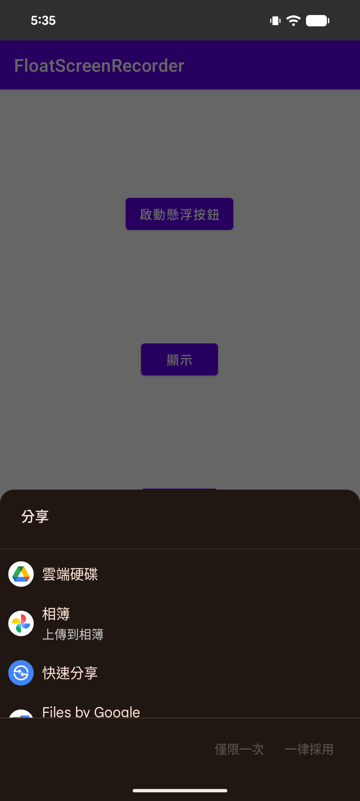

# 🎥 FloatScreenRecorder - Android 浮動螢幕錄製 SDK

一個功能完整的 Android 螢幕錄製 SDK，提供浮動按鈕控制、循環分段錄製與分享等核心功能。採用模組化架構設計，易於整合到現有應用中。

## 📱 專案簡介

FloatScreenRecorder 是一款專業的 Android 螢幕錄製 SDK，支援透過浮動按鈕快速啟動錄製、循環分段錄製與分享等功能。SDK 自動處理權限請求、生命週期管理和設備兼容性檢查，讓開發者能夠輕鬆整合螢幕錄製功能。

## ✨ 功能特點

### 核心錄製功能
- 🎬 **循環分段錄製**：自動分段錄製，預設每段 30 秒，支援長時間錄製
- 📹 **高品質錄製**：支援 1080p/720p 錄製品質
- 🎤 **音訊錄製**：支援系統音訊錄製，44.1kHz 採樣率，128kbps 位元率
- 📤 **影片分享**：一鍵分享錄製的影片到其他應用

### 浮動按鈕功能
- 🎯 **可自定義浮動按鈕**：支援自定義按鈕圖標、大小、位置和透明度
- 📍 **多種定位選項**：支援左上、左下、右上、右下四個角落定位
- 📏 **三種尺寸選擇**：大、中、小三種尺寸（60dp/50dp/40dp），適應不同使用場景
- 🎨 **自定義子按鈕**：支援添加自定義子按鈕，擴展功能
- 🔘 **自動收合展開**：智能展開和收合動畫效果
- 👆 **拖拽移動**：支援拖拽移動浮動按鈕位置，自動邊緣吸附
- 🗑️ **刪除區域**：拖拽到刪除區域可移除浮動按鈕

## 🏗️ 技術架構

### 架構模式
本專案結合管理器模式、回調模式和單例模式，實現清晰的職責分離和易於維護的程式碼結構。

### 架構分層

```
┌─────────────────────────────────────┐
│      SDK 接口層 (API Layer)          │
│  - EvanSDK (靜態方法接口)             │
│  - Recording (錄製功能接口)           │
└─────────────────────────────────────┘
                  ↓
┌─────────────────────────────────────┐
│      Activity 層 (UI Layer)           │
│  - MainActivity (範例主頁面)          │
│  - FABActivity (浮動按鈕頁面)         │
│  - RecordingActivity (錄製頁面)      │
│  - PermissionActivity (權限頁面)     │
│  - ShareVideoActivity (分享頁面)     │
└─────────────────────────────────────┘
                  ↓
┌─────────────────────────────────────┐
│      Manager 層 (業務邏輯層)           │
│  - RecordingManager (錄製管理)        │
│  - FABManager (浮動按鈕管理)          │
│  - FABScreenManager (螢幕管理)       │
│  - ScreenManager (螢幕資訊管理)      │
│  - CallbackManager (回調管理)        │
│  - LiveDataManager (數據觀察)        │
└─────────────────────────────────────┘
                  ↓
┌─────────────────────────────────────┐
│      Service 層 (後台服務)            │
│  - RecordingService (錄製服務)       │
│  - FABService (浮動按鈕服務)          │
└─────────────────────────────────────┘
                  ↓
┌─────────────────────────────────────┐
│      Model 層 (數據模型)              │
│  - FloatingConfigurationModel        │
│  - Constants (常量定義)               │
└─────────────────────────────────────┘
                  ↓
┌─────────────────────────────────────┐
│      Util 層 (工具類)                 │
│  - FileUtil (檔案處理)                │
│  - PermissionUtils (權限處理)        │
│  - DeviceUtils (設備資訊)             │
│  - LocalJsonUtils (本地圖片讀取)     │
│  - CircleBitmap (圓形圖片處理)       │
│  - ClickUtil (點擊工具)              │
│  - MemoryManager (記憶體管理)        │
│  - ToastUtil (提示工具)              │
│  - LogUtil (日誌工具)                │
│  - StrUtil (字串工具)                 │
└─────────────────────────────────────┘
```

### 核心設計模式

1. **管理器模式**：每個功能模組由專門的管理器負責，如 `RecordingManager`、`FABManager`
2. **回調模式**：使用回調接口實現異步操作結果通知
3. **單例模式**：管理器使用靜態方法確保唯一實例
4. **觀察者模式**：使用 `LiveData` 實現響應式數據觀察
5. **ContentProvider 模式**：使用 `SDKProvider` 實現 SDK 自動初始化


## 🛠️ 技術棧

### 主要依賴
- **AndroidX AppCompat**：1.6.1
- **AndroidX Lifecycle**：2.2.0 (LiveData, LifecycleObserver)
- **Material Design**：1.10.0

### Android 功能
- **MediaProjection API**：螢幕錄製核心 API
- **MediaRecorder**：音影片錄製
- **WindowManager**：浮動視窗管理
- **Foreground Service**：前台服務維持錄製
- **ContentProvider**：SDK 自動初始化


## 🚀 快速開始

### 1. 初始化 SDK

在 `Application` 類或主 `Activity` 的 `onCreate` 中初始化：

```java
EvanSDK.init(this);
```

**注意**：SDK 會透過 `ContentProvider` 自動初始化，但建議手動調用 `init()` 確保工具類正確初始化。

### 2. 顯示浮動按鈕

```java
FloatingConfigurationModel config = new FloatingConfigurationModel();
config.setOrigin(FloatingOriginType.BOTTOM_RIGHT);  // 設置位置
config.setSize(FloatingSizeType.MEDIUM);            // 設置大小
config.setFloatingOptionsType(FloatingOptionsType.ALL_OPTIONS);  // 設置功能選項

EvanSDK.showFloatingButtonWithConfiguration(
    this, 
    config, 
    new NativeFloatingButtonCallback() {
        @Override
        public void onClick(int customizedChildButtonIndex) {
            // 處理自定義按鈕點擊
            // customizedChildButtonIndex >= 101 表示自定義按鈕
        }

        @Override
        public void onError(String msg) {
            // 處理錯誤
        }

        @Override
        public void onClose(String msg) {
            // 處理關閉事件
        }
    }
);
```

### 3. 控制浮動按鈕顯示/隱藏

```java
// 顯示浮動按鈕
EvanSDK.setFloatingButtonDisplay(this, true);

// 隱藏浮動按鈕
EvanSDK.setFloatingButtonDisplay(this, false);
```

### 4. 控制循環錄製

```java
// 開始錄製
EvanSDK.setLoopRecordingStatus(
    this, 
    true, 
    new RecordingStatusCallback() {
        @Override
        public void onSuccess(boolean isRecording) {
            // 錄製狀態改變成功
            if (isRecording) {
                // 錄製已開始
            } else {
                // 錄製已停止
            }
        }

        @Override
        public void onError(String msg) {
            // 錄製失敗，msg 包含錯誤訊息
        }
    }
);

// 停止錄製
EvanSDK.setLoopRecordingStatus(
    this, 
    false, 
    new RecordingStatusCallback() {
        @Override
        public void onSuccess(boolean isRecording) {
            // 停止成功
        }

        @Override
        public void onError(String msg) {
            // 停止失敗
        }
    }
);
```

### 5. 分享錄製影片

```java
EvanSDK.shareRecordVideo(
    this, 
    new ShareVideoCallback() {
        @Override
        public void onFinish() {
            // 分享流程完成（用戶完成分享或取消）
            // 系統會自動打開分享選擇器
        }

        @Override
        public void onError(String shareMsg) {
            // 分享失敗，shareMsg 包含錯誤訊息
        }
    }
);
```

## 📸 實機畫面展示

### 浮動按鈕界面


### 影片分享界面


## 👨‍💻 開發者

- **開發者**：Evan
- **專案開始時間**：2021/11/17

## 📄 許可證

本專案僅供學習和交流使用。

---

**輕鬆整合，專業錄製！** 🎥📱
